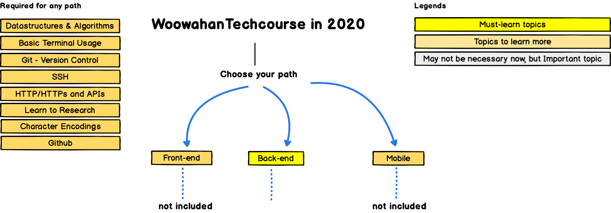

## Introduction
아래 커리큘럼은 제 개인적인 백엔드 공부 경험을 바탕으로 자료들을 정리하여 작성하였습니다.

백엔드 개발자가 되고 싶지만 어디서부터 시작해야 할지 막막하실 단국대 학우분들에게 참고용 정도만으로 도움이 되었으면 합니다.

(내용 추가중...)

## Backend RoadMap

## 시작전 읽어보면 좋은 포스트
- [백엔드 개발자를 꿈꾸는 학생개발자에게](https://d2.naver.com/news/3435170)

- [자바 공화국](https://jojoldu.tistory.com/609)

## Contents

## [1. Basic-Java-Study](docs/1_Basic-Java-Study.md)

> [repo-link](https://github.com/DKU-SPRINGLES/Basic-Java-Study)

- 프로그래밍 언어에 대한 기본 문법을 익힙니다. (Java)

- 아래 책중 하나를 읽어서 객체지향 개념을 익힙니다.
    - `객체지향의 사실과 오해 - 조영호 저`
    - `스프링 입문을 위한 자바 객체 지향의 원리와 이해 - 김종민 저`

## [2. Mission-Base-Project](docs/2_Mission-Base-Project.md)

> repo-link (to be continued..)

- git 사용법을 익힙니다.

- **객체지향 설계**를 경험합니다.

- **읽기 좋은 코드**를 구현하는 것이 왜 중요한지와 코드를 개선해 읽기 좋은 코드로 변경해 보는 경험을 하는 것이 중요하다고 생각합니다.

- 자신이 구현한 코드에 대해 **단위 테스트**를 작성하고 **리팩토링**하는 경험을 합니다.

## 3. Project

- 개발 프로세스 기반으로 프로젝트 진행, 협업하는 경험을 합니다.

- 배포를 자동화하고, 피드백을 받아 지속적으로 개선하는 경험을 합니다.
